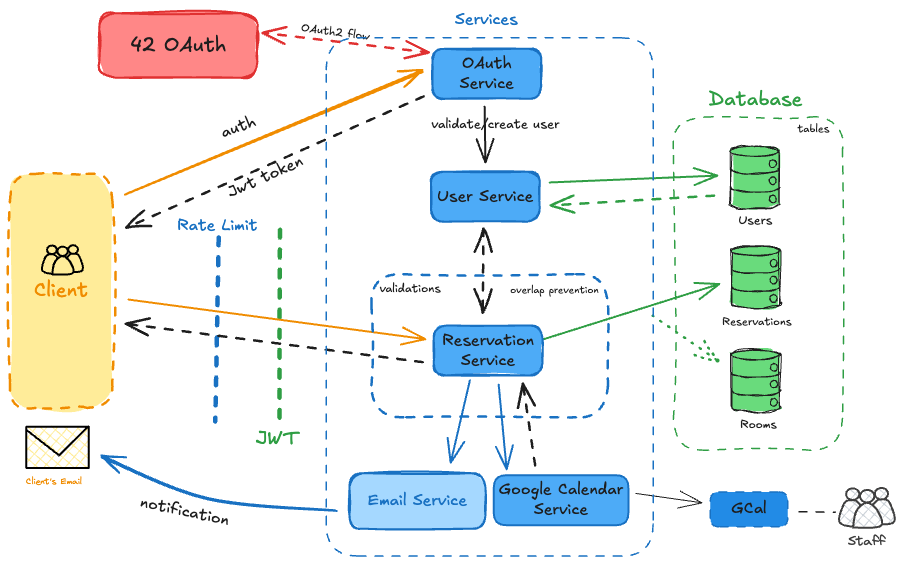

<div align="center">

# BookMe – Meeting Room Reservation Backend

[](https://github.com/ibnbaqqi/book-me/blob/main/go.mod)

[](https://goreportcard.com/report/github.com/IbnBaqqi/book-me)


**A Modern Meeting Room Booking System For Hive Helsinki**

[Live App](https://room.hive.fi) • [Frontend Repo](https://github.com/danielxfeng/booking_calendar.git) • [API Docs](docs/api_overview.md)

</div>

---

## Table of Contents

- [About](#about)
- [Features](#features)
- [Tech Stack](#tech-stack)
- [Quick Start](#quick-start)
- [Project Structure](#project-structure)
- [Development](#development)
- [API Quick Reference](#api-quick-reference)
- [Documentation](#documentation)
- [Contributing](#contributing)
- [License](#license)

---

## About

BookMe is a backend API for managing meeting room reservations at Hive Helsinki. It provides secure authentication via 42 Intra OAuth2, role-based access control, and seamless Google Calendar integration for staff members.

---

### Basic System Architecture Diagram


## Features

- **42 Intra OAuth2 Login**: Secure authentication using Hive Helsinki’s 42 Intranet
- **Smart Booking Logic**: Prevents overlapping reservations and restricts cancellation rights
- **Role-Based Access**:
  - Staff can view who booked each slot and cancel any booking
  - Students can only see availability and cancel their own bookings
- **Calendar API**: Fetches unavailable time slots for specific date ranges
- **Secure JWT Authentication**: Stateless session management using JSON Web Tokens
- **Email Notifications**: Sends confirmations and updates to users via SendGrid
- **Google Calendar Integration**: Allows staff to sync bookings with Google Calendar

---
## Tech Stack
- **Go 1.22+** - Backend language
- **PostgreSQL 14+** - Database with SQLC for type-safe queries
- **Go Standard library net/http** - HTTP server (no framework)
---

## Quick Start

```bash
# Clone the repository
git clone https://github.com/IbnBaqqi/book-me.git
cd book-me

# Install dependencies
go mod download

# Set up environment variables
cp .env.example .env
# Edit .env with your credentials

# Run database migrations
goose -dir sql/schema postgres "your-db-url" up

# Start the server
make run
```

Server runs at `http://localhost:8080`

**Detailed setup instructions:** [docs/setup.md](docs/setup.md)

---

## Project Structure

```bash
book-me/
├── cmd/
│   └── server/
│       └── main.go                 # Application entry point
├── internal/
│   ├── api/                        # API server setup
│   │   ├── api.go
│   │   └── routes.go
│   ├── auth/                       # JWT authentication
│   │   ├── auth.go
│   │   └── auth_test.go
│   ├── config/                     # Configuration management
│   │   └── config.go
│   ├── database/                   # SQLC generated code & DB connection
│   │   ├── connection.go
│   │   ├── db.go
│   │   ├── models.go
│   │   ├── reservations.sql.go
│   │   ├── rooms.sql.go
│   │   └── users.sql.go
│   ├── dto/                        # Data transfer objects
│   │   └── reservation.go
│   ├── email/                      # SendGrid-backed email service
│   │   ├── email_service.go
│   │   ├── email_service_test.go
│   ├── google/                     # Google Calendar integration
│   │   ├── calender.go
│   │   └── calendar_test.go
│   ├── handler/                    # HTTP handlers
│   │   ├── handler.go
│   │   ├── handler_health.go
│   │   ├── handler_oauth.go
│   │   ├── handler_reservations.go
│   │   ├── parser.go
│   │   ├── parser_test.go
│   │   └── response.go
│   ├── logger/                     # Logging utilities
│   │   └── logger.go
│   ├── middleware/                 # HTTP middleware
│   │   ├── auth.go
│   │   ├── auth_test.go
│   │   ├── ratelimit.go
│   │   └── ratelimit_test.go
│   ├── oauth/                      # OAuth2 authentication
│   │   ├── errors.go
│   │   ├── provider42.go
│   │   └── service.go
│   ├── service/                    # Business logic layer
│   │   ├── errors.go
│   │   └── reservation.go
│   └── validator/                  # Input validation
│       ├── errors.go
│       ├── validator.go
│       └── validator_test.go
├── sql/                            # Database migrations and queries
│   ├── queries/
│   │   ├── reservations.sql
│   │   ├── rooms.sql
│   │   └── users.sql
│   └── schema/
│       ├── 001_users.sql
│       ├── 002_rooms.sql
│       ├── 003_reservations.sql
│       └── 004_populate_rooms.sql
├── docs/                           # Documentation
│   ├── api_overview.md
│   ├── setup.md
│   └── usage.md
├── assets/                         # Static assets
│   ├── book-me-service-account.json
│   └── v3BookMe-whiteBg.png
├── .env.example
├── .gitignore
├── .golangci.yml
├── go.mod
├── go.sum
├── LICENSE
├── Makefile
├── sqlc.yaml
└── README.md
```

---

## Development

### Building

```bash
# Build binary
make build

# Binary will be at: bin/book-me
./bin/book-me
```

### Running Tests

```bash
# Run all tests
make test

# Run tests with coverage
make test-coverage
```

### Code Quality

```bash
# Format code
make fmt

# Run linter
golangci-lint run

# Generate SQLC code after modifying SQL queries
make sqlc
```

---

## API Quick Reference

| Method | Endpoint | Description | Auth |
|--------|----------|-------------|------|
| GET | `/oauth/login` | Initiate OAuth login | No |
| GET | `/oauth/callback` | OAuth callback | No |
| POST | `/api/v1/reservations` | Create reservation | Yes |
| GET | `/api/v1/reservations?start=DATE&end=DATE` | Get unavailable slots | Yes |
| DELETE | `/api/v1/reservations/{id}` | Cancel reservation | Yes |
| GET | `/api/v1/health` | Health check | No |

📖 **Full API documentation:** [docs/api_overview.md](docs/api_overview.md)

---

## Documentation

- **[Setup Guide](docs/setup.md)** - Installation and configuration
- **[API Overview](docs/api_overview.md)** - Endpoints and examples
- **[Dependencies](docs/usage.md)** - Libraries and why they're used

---

## Contributing
Contributions are welcome! Please feel free to submit a Pull Request.

---

## License

MIT License

---